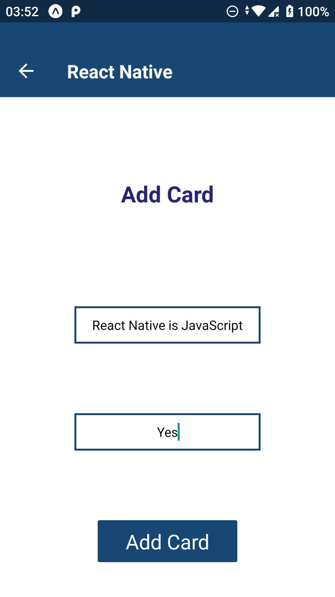
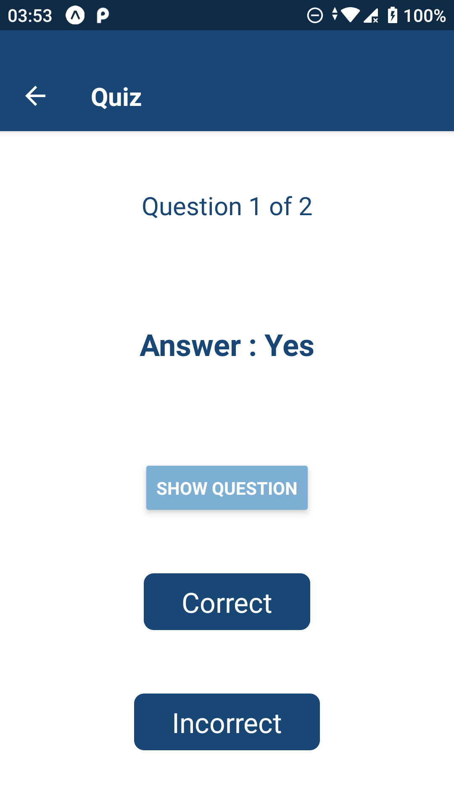

# Flashcards

---

## Project Purpose:

This is a Udacity React Nanodegree Project. This project is Flashcards app where an user can add a new deck to the list of decks, add cards to a deck, take a quiz for a deck and view results. The purpose of this project is to implement the same in react-native. The app will showcase react-native fundamentals and functionalities like AsyncStorage, Styling, Tab Navigation, Stack Navigation, Local notifications and Animation effects.

## How to Load the App

The project uses Expo and the Create-React-Native-App starter. If you do not have Expo-cli installed, you can download it here: [Expo](https://expo.io/tools)

Once Expo cli is installed and the account is created, navigate to the directory where you want to store the app

```
git clone https://github.com/harishb93/flashcards.git
yarn
<or>
git clone https://github.com/harishb93/flashcards.git
npm install
```

Once all of the dependencies have been installed you can launch the app with

```
yarn start
<or>
npm start
```

A new browser window should automatically open displaying the Expo DevTools. If it doesn't, navigate to [http://localhost:19002/](http://localhost:19002/) in your browser. You may want to connect your physical device to your computer or have an emulator set up with ADB configured for Expo to be able to pick it up.


## How to Use the App

- User can add a new deck
  

- Selected user can view his/her Decks
  

- User can view an individual deck
  

- Deck when no cards are added
  

- User can add a new card to a deck
  

- User can take a quiz
  

  

  
